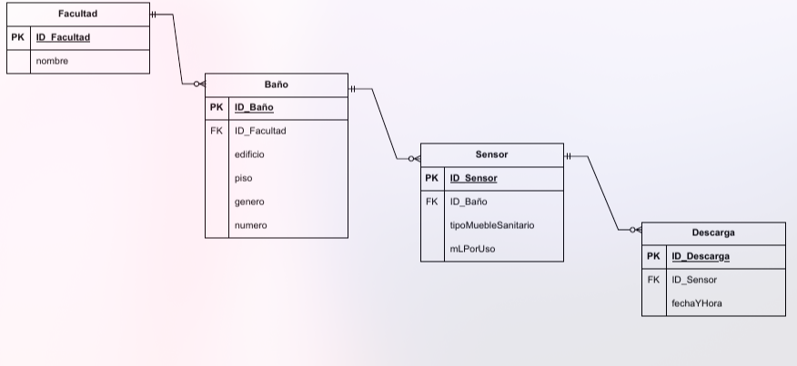

# Requisitos
- Visual Studio Code, con la extensión Dev Containers
- WSL o Linux (Opcional, pero es altamente recomendado debido a la compatibilidad)
- Docker con Docker Compose
- Git
- GitHub Desktop(recomendable)

# Página Web
Para el desarrollo de la página web se utiliza el framework Next.JS 22.14.0.

Para agilizar el desarrollo, se optó por utilizar la librería de componentes de Material UI. La documentación para esta librería se encuentra en [este link](https://mui.com/material-ui/getting-started/)

Para mostrar los datos de la base de datos, se utilizó el componente de MUI [Data Grid](https://mui.com/x/react-data-grid/).

Para el mapa de calor se utilizó la librería de [react heatmap](https://github.com/uiwjs/react-heat-map?tab=readme-ov-file).

## Estructura
### Homepage
Se presenta un breve resumen del proyecto.
>**TO-DO** Cambiar el logo de Opticom por el logo definitivo del proyecto.
### Datos
Se presentan los datos de los sensores, por medio de una tabla, heatmap y gráfica de pastel/barras, etc. Se pueden filtrar los datos, en campo de texto como con parámetros en el URL
>**TO-DO**
>- Agregar autenticación, los datos no se muestran si no hay una sesión existente.
>- Agregar los filtros faltantes.
>- Agregar los campos de selección para los filtros, como en la página de planos. 
>- Agregar las gráficas faltantes.

### Planos
Esta sección debe mostrar la ubicación e identificación de los sensores en los planos de los baños. Al igual que la página de datos, se debe tener un sistema de autenticación.
>**TO-DO**
>- Agregar sistema de almacenamiento de los planos (DB de preferencia)
>- Agregar los planos

### ¿Quienes Somos?
Esta sección muestra más información acerca del proyecto y los involucrados.
## Autenticación

Para el sistema de autenticación se comenzó a usar [NextAuth](https://next-auth.js.org/getting-started/introduction). 

>**TO-DO** se debe implementar todo el sistema de autenticación. Los requisitos son los siguientes:
>- Una base de datos diferente, dedicada a solo los datos de los usuarios
>- La contraseña debe de ser almacenada encriptada en la DB
>- Mostrar el formulario de login al acceder a los datos o a los planos si no existe una sesión.

## Conexión con base de datos
Para la conexión con la base de datos se utiliza la librería de [mysql2/promise](https://www.npmjs.com/package/mysql2-promise).
En el archivo /src/app/lib/databaseConnection.jsx se encuentra la configuración para esta conexión. 

>**Importante** cambiar estos valores por los definitivos para producción, además de almacenarlos en un archivo .env para mayor seguridad. Los valores aqui son solo de prueba.

### API's
Las API's se encuentran en /src/app/api.

Para obtener la información de la DB se usa el archivo /mysql/filteredDischarges/route.jsx. Esta recibe los filtros que se deseen y genera una query. mysql/discharges.jsx se encuentra en desuso.

>**TO-DO** 
>- Se deben protejer estas API's mediante NextAuth, solo si se tiene una sesión válida se crea la conexión a la base de datos y se ejecuta el query.
>- Se debe agregar encriptación a las respuestas de la base de datos.

# Base de datos
El sistema de administración de base de datos es MySQL 9. Se utiliza PHP MyAdmin para tener una interfaz gráfica.

La base de datos tiene la siguiente estructura: 

> **TO-DO**
>- Se debe crear una base de datos exclusiva para los datos de autenticación y para los planos
>- Se debe encriptar las respuestas de lo querys (MySQL tiene metodos built-in)
